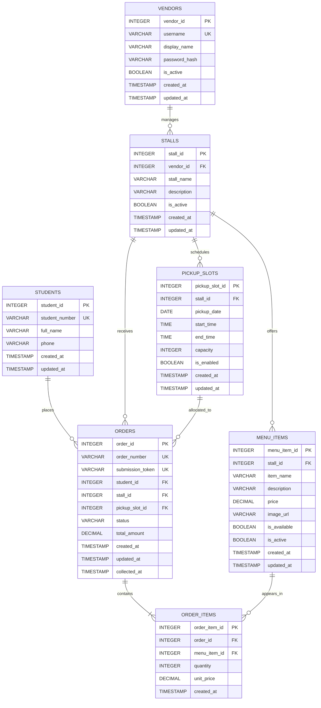

# CanteenFlow Database Design

## Document Information

| Field | Details |
|---|---|
| Application | CanteenFlow |
| Database | PostgreSQL-compatible relational database |
| Student | Sudasun (6605142003) |
| Project owner | Sudasun (sole project owner) |
| Work type | Individual assignment |
| Last updated | 5 September 2026 |

## 1. Database Overview

The CanteenFlow database supports a campus food pre-order and pickup MVP. It stores student contact details needed for collection, vendor accounts, participating stalls, menu items, pickup capacity, orders, and the items in each order. Payment is made at collection, so no payment data is stored.

The design uses seven tables only: `students`, `vendors`, `stalls`, `menu_items`, `pickup_slots`, `orders`, and `order_items`. PostgreSQL constraints protect basic integrity, while transactions and application-level checks protect rules that involve multiple rows.

## 2. Design Assumptions

- One vendor account can manage one or more stalls; each stall has one responsible vendor account in the MVP.
- Each menu item and pickup slot belongs to exactly one stall.
- One order is placed by one student for one stall and one pickup slot.
- One order contains one or more order items, all linked to menu items from the order's stall.
- A menu item's current price and availability can change. `order_items.unit_price` preserves the price accepted with the order.
- Pickup slot capacity counts accepted orders except those with status `CANCELLED`.
- Server and database timestamps are authoritative; the interface presents them in the configured campus-local time zone.
- Student details are created or updated as part of checkout; the MVP does not require a student account-history interface.
- Order submission uses a client-generated token so retries can safely return the existing order.

## 3. Entity Descriptions

| Entity | Purpose |
|---|---|
| `students` | Stores the minimum student identity and contact data required for ordering and retrieval |
| `vendors` | Stores vendor login identity and password hash |
| `stalls` | Stores participating campus food stalls and their responsible vendor |
| `menu_items` | Stores food offered by each stall, including price, image, and availability |
| `pickup_slots` | Stores stall-specific pickup dates, times, capacity, and availability |
| `orders` | Stores the order header, student, stall, pickup slot, totals, status, and timestamps |
| `order_items` | Stores item quantities and accepted unit prices for each order |

## 4. Relationships and Cardinality

| Relationship | Cardinality | Meaning |
|---|---|---|
| `vendors` to `stalls` | One-to-many | One vendor may manage many stalls; each stall has one vendor |
| `stalls` to `menu_items` | One-to-many | One stall may offer many items; each item belongs to one stall |
| `stalls` to `pickup_slots` | One-to-many | One stall may publish many slots; each slot belongs to one stall |
| `students` to `orders` | One-to-many | One student may place many orders; each order has one student |
| `stalls` to `orders` | One-to-many | One stall may receive many orders; each order is for one stall |
| `pickup_slots` to `orders` | One-to-many | One slot may contain orders up to capacity; each order uses one slot |
| `orders` to `order_items` | One-to-many | One order has one or more lines; each line belongs to one order |
| `menu_items` to `order_items` | One-to-many | One menu item may appear in many order lines; each line refers to one item |

## 5. Primary and Foreign Keys

Each table has an integer surrogate primary key generated by PostgreSQL. A primary key uniquely identifies a row and cannot be null. Foreign keys connect related entities and prevent references to rows that do not exist. `ON DELETE RESTRICT` protects historical orders and required parent records; `ON DELETE CASCADE` is used only for `order_items`, which have no meaning without their order.

Business identifiers also have unique constraints: `students.student_number`, `vendors.username`, `orders.order_number`, and `orders.submission_token`. Composite unique constraints prevent duplicate stall names for one vendor, duplicate item names in one stall, duplicate pickup start times in one stall, and duplicate menu-item lines in one order.

## 6. Entity-Relationship Diagram



`UK` in the diagram indicates a column protected by a `UNIQUE` constraint.

## 7. Data Dictionary

### 7.1 `students`

| Column | Data type | Key | Null rule | Default | Constraints | Description |
|---|---|---|---|---|---|---|
| `student_id` | `INTEGER` | PK | NOT NULL | Identity | Positive generated value | Internal student identifier |
| `student_number` | `VARCHAR(20)` | Unique | NOT NULL | None | 1-20 letters or digits | Student ID used with an order number for retrieval |
| `full_name` | `VARCHAR(100)` | — | NOT NULL | None | Trimmed value must not be empty | Name shown to the vendor |
| `phone` | `VARCHAR(20)` | — | NOT NULL | None | 7-20 digits, spaces, `+`, or `-` | Contact number for order handling |
| `created_at` | `TIMESTAMP WITH TIME ZONE` | — | NOT NULL | `CURRENT_TIMESTAMP` | — | Row creation time |
| `updated_at` | `TIMESTAMP WITH TIME ZONE` | — | NOT NULL | `CURRENT_TIMESTAMP` | Updated by the application on change | Last modification time |

### 7.2 `vendors`

| Column | Data type | Key | Null rule | Default | Constraints | Description |
|---|---|---|---|---|---|---|
| `vendor_id` | `INTEGER` | PK | NOT NULL | Identity | Positive generated value | Internal vendor identifier |
| `username` | `VARCHAR(50)` | Unique | NOT NULL | None | 3-50 lowercase letters, digits, `.`, `_`, or `-` | Vendor login name |
| `display_name` | `VARCHAR(100)` | — | NOT NULL | None | Trimmed value must not be empty | Vendor name shown in management views |
| `password_hash` | `VARCHAR(255)` | — | NOT NULL | None | Trimmed value must not be empty | Salted adaptive password hash, never a plain password |
| `is_active` | `BOOLEAN` | — | NOT NULL | `TRUE` | — | Whether the account may sign in |
| `created_at` | `TIMESTAMP WITH TIME ZONE` | — | NOT NULL | `CURRENT_TIMESTAMP` | — | Row creation time |
| `updated_at` | `TIMESTAMP WITH TIME ZONE` | — | NOT NULL | `CURRENT_TIMESTAMP` | Updated by the application on change | Last modification time |

### 7.3 `stalls`

| Column | Data type | Key | Null rule | Default | Constraints | Description |
|---|---|---|---|---|---|---|
| `stall_id` | `INTEGER` | PK | NOT NULL | Identity | Positive generated value | Internal stall identifier |
| `vendor_id` | `INTEGER` | FK | NOT NULL | None | References `vendors.vendor_id`; unique with `stall_name` | Vendor responsible for the stall |
| `stall_name` | `VARCHAR(100)` | Composite unique | NOT NULL | None | Trimmed value must not be empty | Public stall name |
| `description` | `VARCHAR(500)` | — | NULL | None | — | Optional short stall description |
| `is_active` | `BOOLEAN` | — | NOT NULL | `TRUE` | — | Whether the stall participates and is displayed |
| `created_at` | `TIMESTAMP WITH TIME ZONE` | — | NOT NULL | `CURRENT_TIMESTAMP` | — | Row creation time |
| `updated_at` | `TIMESTAMP WITH TIME ZONE` | — | NOT NULL | `CURRENT_TIMESTAMP` | Updated by the application on change | Last modification time |

### 7.4 `menu_items`

| Column | Data type | Key | Null rule | Default | Constraints | Description |
|---|---|---|---|---|---|---|
| `menu_item_id` | `INTEGER` | PK | NOT NULL | Identity | Positive generated value | Internal menu-item identifier |
| `stall_id` | `INTEGER` | FK | NOT NULL | None | References `stalls.stall_id`; unique with `item_name` | Stall offering the item |
| `item_name` | `VARCHAR(120)` | Composite unique | NOT NULL | None | Trimmed value must not be empty | Public food-item name |
| `description` | `VARCHAR(500)` | — | NULL | None | — | Optional item description |
| `price` | `DECIMAL(10,2)` | — | NOT NULL | None | Greater than 0 | Current selling price |
| `image_url` | `VARCHAR(500)` | — | NOT NULL | None | Trimmed value must not be empty | Image location used by the menu |
| `is_available` | `BOOLEAN` | — | NOT NULL | `TRUE` | — | Whether students may currently order the item |
| `is_active` | `BOOLEAN` | — | NOT NULL | `TRUE` | — | Whether the item remains part of the menu |
| `created_at` | `TIMESTAMP WITH TIME ZONE` | — | NOT NULL | `CURRENT_TIMESTAMP` | — | Row creation time |
| `updated_at` | `TIMESTAMP WITH TIME ZONE` | — | NOT NULL | `CURRENT_TIMESTAMP` | Updated by the application on change | Last modification time |

### 7.5 `pickup_slots`

| Column | Data type | Key | Null rule | Default | Constraints | Description |
|---|---|---|---|---|---|---|
| `pickup_slot_id` | `INTEGER` | PK | NOT NULL | Identity | Positive generated value | Internal pickup-slot identifier |
| `stall_id` | `INTEGER` | FK | NOT NULL | None | References `stalls.stall_id`; unique with date and start time | Stall providing the slot |
| `pickup_date` | `DATE` | Composite unique | NOT NULL | None | — | Calendar date for pickup |
| `start_time` | `TIME` | Composite unique | NOT NULL | None | Earlier than `end_time` | Start of pickup window |
| `end_time` | `TIME` | — | NOT NULL | None | Later than `start_time` | End of pickup window |
| `capacity` | `INTEGER` | — | NOT NULL | None | From 1 to 500 | Maximum accepted, non-cancelled orders |
| `is_enabled` | `BOOLEAN` | — | NOT NULL | `TRUE` | — | Whether new orders may use the slot |
| `created_at` | `TIMESTAMP WITH TIME ZONE` | — | NOT NULL | `CURRENT_TIMESTAMP` | — | Row creation time |
| `updated_at` | `TIMESTAMP WITH TIME ZONE` | — | NOT NULL | `CURRENT_TIMESTAMP` | Updated by the application on change | Last modification time |

### 7.6 `orders`

| Column | Data type | Key | Null rule | Default | Constraints | Description |
|---|---|---|---|---|---|---|
| `order_id` | `INTEGER` | PK | NOT NULL | Identity | Positive generated value | Internal order identifier |
| `order_number` | `VARCHAR(30)` | Unique | NOT NULL | None | Trimmed value must not be empty | Public order reference |
| `submission_token` | `VARCHAR(64)` | Unique | NOT NULL | None | Length 16-64 | Client token used to prevent duplicates |
| `student_id` | `INTEGER` | FK | NOT NULL | None | References `students.student_id` | Student placing the order |
| `stall_id` | `INTEGER` | FK | NOT NULL | None | References `stalls.stall_id` | Stall receiving the order |
| `pickup_slot_id` | `INTEGER` | FK | NOT NULL | None | References `pickup_slots.pickup_slot_id` | Selected pickup slot |
| `status` | `VARCHAR(20)` | — | NOT NULL | `'RECEIVED'` | One of five allowed values | Current order status |
| `total_amount` | `DECIMAL(12,2)` | — | NOT NULL | None | Greater than 0 | Sum of stored order-item line totals |
| `created_at` | `TIMESTAMP WITH TIME ZONE` | — | NOT NULL | `CURRENT_TIMESTAMP` | — | Submission time |
| `updated_at` | `TIMESTAMP WITH TIME ZONE` | — | NOT NULL | `CURRENT_TIMESTAMP` | Updated by the application on change | Last status or content update time |
| `collected_at` | `TIMESTAMP WITH TIME ZONE` | — | NULL | None | Required only for `COLLECTED` | Time the vendor confirmed collection |

### 7.7 `order_items`

| Column | Data type | Key | Null rule | Default | Constraints | Description |
|---|---|---|---|---|---|---|
| `order_item_id` | `INTEGER` | PK | NOT NULL | Identity | Positive generated value | Internal order-line identifier |
| `order_id` | `INTEGER` | FK, composite unique | NOT NULL | None | References `orders.order_id`; unique with `menu_item_id` | Parent order |
| `menu_item_id` | `INTEGER` | FK, composite unique | NOT NULL | None | References `menu_items.menu_item_id` | Ordered menu item |
| `quantity` | `INTEGER` | — | NOT NULL | None | From 1 to 20 | Number of units ordered |
| `unit_price` | `DECIMAL(10,2)` | — | NOT NULL | None | Greater than 0 | Price per unit captured at submission |
| `created_at` | `TIMESTAMP WITH TIME ZONE` | — | NOT NULL | `CURRENT_TIMESTAMP` | — | Order-line creation time |

## 8. PostgreSQL `CREATE TABLE` Statements

```sql
CREATE TABLE students (
    student_id INTEGER GENERATED ALWAYS AS IDENTITY PRIMARY KEY,
    student_number VARCHAR(20) NOT NULL UNIQUE,
    full_name VARCHAR(100) NOT NULL,
    phone VARCHAR(20) NOT NULL,
    created_at TIMESTAMP WITH TIME ZONE NOT NULL DEFAULT CURRENT_TIMESTAMP,
    updated_at TIMESTAMP WITH TIME ZONE NOT NULL DEFAULT CURRENT_TIMESTAMP,
    CONSTRAINT ck_students_number
        CHECK (student_number ~ '^[A-Za-z0-9]{1,20}$'),
    CONSTRAINT ck_students_name
        CHECK (char_length(btrim(full_name)) BETWEEN 1 AND 100),
    CONSTRAINT ck_students_phone
        CHECK (phone ~ '^[0-9 +\-]{7,20}$')
);

CREATE TABLE vendors (
    vendor_id INTEGER GENERATED ALWAYS AS IDENTITY PRIMARY KEY,
    username VARCHAR(50) NOT NULL UNIQUE,
    display_name VARCHAR(100) NOT NULL,
    password_hash VARCHAR(255) NOT NULL,
    is_active BOOLEAN NOT NULL DEFAULT TRUE,
    created_at TIMESTAMP WITH TIME ZONE NOT NULL DEFAULT CURRENT_TIMESTAMP,
    updated_at TIMESTAMP WITH TIME ZONE NOT NULL DEFAULT CURRENT_TIMESTAMP,
    CONSTRAINT ck_vendors_username
        CHECK (username ~ '^[a-z0-9._-]{3,50}$'),
    CONSTRAINT ck_vendors_display_name
        CHECK (char_length(btrim(display_name)) BETWEEN 1 AND 100),
    CONSTRAINT ck_vendors_password_hash
        CHECK (char_length(btrim(password_hash)) > 0)
);

CREATE TABLE stalls (
    stall_id INTEGER GENERATED ALWAYS AS IDENTITY PRIMARY KEY,
    vendor_id INTEGER NOT NULL,
    stall_name VARCHAR(100) NOT NULL,
    description VARCHAR(500),
    is_active BOOLEAN NOT NULL DEFAULT TRUE,
    created_at TIMESTAMP WITH TIME ZONE NOT NULL DEFAULT CURRENT_TIMESTAMP,
    updated_at TIMESTAMP WITH TIME ZONE NOT NULL DEFAULT CURRENT_TIMESTAMP,
    CONSTRAINT fk_stalls_vendor FOREIGN KEY (vendor_id)
        REFERENCES vendors(vendor_id) ON DELETE RESTRICT,
    CONSTRAINT uq_stalls_vendor_name UNIQUE (vendor_id, stall_name),
    CONSTRAINT ck_stalls_name
        CHECK (char_length(btrim(stall_name)) BETWEEN 1 AND 100)
);

CREATE TABLE menu_items (
    menu_item_id INTEGER GENERATED ALWAYS AS IDENTITY PRIMARY KEY,
    stall_id INTEGER NOT NULL,
    item_name VARCHAR(120) NOT NULL,
    description VARCHAR(500),
    price DECIMAL(10,2) NOT NULL,
    image_url VARCHAR(500) NOT NULL,
    is_available BOOLEAN NOT NULL DEFAULT TRUE,
    is_active BOOLEAN NOT NULL DEFAULT TRUE,
    created_at TIMESTAMP WITH TIME ZONE NOT NULL DEFAULT CURRENT_TIMESTAMP,
    updated_at TIMESTAMP WITH TIME ZONE NOT NULL DEFAULT CURRENT_TIMESTAMP,
    CONSTRAINT fk_menu_items_stall FOREIGN KEY (stall_id)
        REFERENCES stalls(stall_id) ON DELETE RESTRICT,
    CONSTRAINT uq_menu_items_stall_name UNIQUE (stall_id, item_name),
    CONSTRAINT ck_menu_items_name
        CHECK (char_length(btrim(item_name)) BETWEEN 1 AND 120),
    CONSTRAINT ck_menu_items_price CHECK (price > 0),
    CONSTRAINT ck_menu_items_image
        CHECK (char_length(btrim(image_url)) > 0)
);

CREATE TABLE pickup_slots (
    pickup_slot_id INTEGER GENERATED ALWAYS AS IDENTITY PRIMARY KEY,
    stall_id INTEGER NOT NULL,
    pickup_date DATE NOT NULL,
    start_time TIME NOT NULL,
    end_time TIME NOT NULL,
    capacity INTEGER NOT NULL,
    is_enabled BOOLEAN NOT NULL DEFAULT TRUE,
    created_at TIMESTAMP WITH TIME ZONE NOT NULL DEFAULT CURRENT_TIMESTAMP,
    updated_at TIMESTAMP WITH TIME ZONE NOT NULL DEFAULT CURRENT_TIMESTAMP,
    CONSTRAINT fk_pickup_slots_stall FOREIGN KEY (stall_id)
        REFERENCES stalls(stall_id) ON DELETE RESTRICT,
    CONSTRAINT uq_pickup_slots_start UNIQUE (stall_id, pickup_date, start_time),
    CONSTRAINT ck_pickup_slots_time CHECK (end_time > start_time),
    CONSTRAINT ck_pickup_slots_capacity CHECK (capacity BETWEEN 1 AND 500)
);

CREATE TABLE orders (
    order_id INTEGER GENERATED ALWAYS AS IDENTITY PRIMARY KEY,
    order_number VARCHAR(30) NOT NULL UNIQUE,
    submission_token VARCHAR(64) NOT NULL UNIQUE,
    student_id INTEGER NOT NULL,
    stall_id INTEGER NOT NULL,
    pickup_slot_id INTEGER NOT NULL,
    status VARCHAR(20) NOT NULL DEFAULT 'RECEIVED',
    total_amount DECIMAL(12,2) NOT NULL,
    created_at TIMESTAMP WITH TIME ZONE NOT NULL DEFAULT CURRENT_TIMESTAMP,
    updated_at TIMESTAMP WITH TIME ZONE NOT NULL DEFAULT CURRENT_TIMESTAMP,
    collected_at TIMESTAMP WITH TIME ZONE,
    CONSTRAINT fk_orders_student FOREIGN KEY (student_id)
        REFERENCES students(student_id) ON DELETE RESTRICT,
    CONSTRAINT fk_orders_stall FOREIGN KEY (stall_id)
        REFERENCES stalls(stall_id) ON DELETE RESTRICT,
    CONSTRAINT fk_orders_pickup_slot FOREIGN KEY (pickup_slot_id)
        REFERENCES pickup_slots(pickup_slot_id) ON DELETE RESTRICT,
    CONSTRAINT ck_orders_number
        CHECK (char_length(btrim(order_number)) > 0),
    CONSTRAINT ck_orders_submission_token
        CHECK (char_length(submission_token) BETWEEN 16 AND 64),
    CONSTRAINT ck_orders_status CHECK (
        status IN ('RECEIVED', 'PREPARING', 'READY', 'COLLECTED', 'CANCELLED')
    ),
    CONSTRAINT ck_orders_total CHECK (total_amount > 0),
    CONSTRAINT ck_orders_collection CHECK (
        (status = 'COLLECTED' AND collected_at IS NOT NULL)
        OR (status <> 'COLLECTED' AND collected_at IS NULL)
    )
);

CREATE TABLE order_items (
    order_item_id INTEGER GENERATED ALWAYS AS IDENTITY PRIMARY KEY,
    order_id INTEGER NOT NULL,
    menu_item_id INTEGER NOT NULL,
    quantity INTEGER NOT NULL,
    unit_price DECIMAL(10,2) NOT NULL,
    created_at TIMESTAMP WITH TIME ZONE NOT NULL DEFAULT CURRENT_TIMESTAMP,
    CONSTRAINT fk_order_items_order FOREIGN KEY (order_id)
        REFERENCES orders(order_id) ON DELETE CASCADE,
    CONSTRAINT fk_order_items_menu_item FOREIGN KEY (menu_item_id)
        REFERENCES menu_items(menu_item_id) ON DELETE RESTRICT,
    CONSTRAINT uq_order_items_order_menu UNIQUE (order_id, menu_item_id),
    CONSTRAINT ck_order_items_quantity CHECK (quantity BETWEEN 1 AND 20),
    CONSTRAINT ck_order_items_unit_price CHECK (unit_price > 0)
);
```

## 9. Useful Indexes

PostgreSQL automatically indexes primary keys and unique constraints. The following additional indexes support the main pages and validation queries:

```sql
CREATE INDEX idx_stalls_active
    ON stalls (stall_name) WHERE is_active = TRUE;

CREATE INDEX idx_menu_items_stall_active_available
    ON menu_items (stall_id, is_active, is_available, item_name);

CREATE INDEX idx_pickup_slots_stall_schedule
    ON pickup_slots (stall_id, pickup_date, start_time)
    WHERE is_enabled = TRUE;

CREATE INDEX idx_orders_stall_pickup_status
    ON orders (stall_id, pickup_slot_id, status);

CREATE INDEX idx_orders_student_created
    ON orders (student_id, created_at DESC);

CREATE INDEX idx_order_items_order
    ON order_items (order_id);
```

## 10. Order Status Values and Transitions

| Status | Meaning | Allowed next status |
|---|---|---|
| `RECEIVED` | The system accepted the order and the stall has it in its queue | `PREPARING` or `CANCELLED` |
| `PREPARING` | The vendor is preparing the food | `READY` or `CANCELLED` |
| `READY` | The food is ready for pickup | `COLLECTED` or `CANCELLED` |
| `COLLECTED` | The student collected and paid for the food | None |
| `CANCELLED` | The order will not be fulfilled | None |

The database `CHECK` constraint limits stored values. The application service must enforce the transition table in the same transaction as the update because a simple row constraint cannot compare the old and new statuses.

## 11. Data-Integrity Rules

1. An order must contain at least one order item. The order service shall insert the header and items in one transaction and reject an empty item list.
2. Every order item must refer to a menu item belonging to the order's stall. The service shall lock and validate all selected menu items before insertion.
3. The selected pickup slot must belong to the order's stall, be enabled, be in the future, and have remaining capacity at commit time.
4. Slot capacity shall be allocated inside a transaction that locks the pickup-slot row and counts orders whose status is not `CANCELLED`; the transaction shall reject a count at or above `capacity`.
5. Only active, available items may be accepted. The latest database price shall be copied to `order_items.unit_price` during the same transaction.
6. `orders.total_amount` shall equal `SUM(order_items.quantity * order_items.unit_price)`. The service calculates and stores both from validated database values in one transaction.
7. A unique `submission_token` makes order creation idempotent. A retry with an existing token returns that order instead of inserting another one.
8. An accepted order begins as `RECEIVED`. Only the documented forward transitions or cancellation are allowed.
9. `collected_at` is set when status becomes `COLLECTED` and remains null for every other status.
10. Rows referenced by historical orders are retained. Menu items and stalls should be made inactive instead of being deleted.
11. The application updates `updated_at` whenever a mutable row changes; timestamps use `CURRENT_TIMESTAMP` from the database transaction.
12. The application shall use `DECIMAL` values for money and shall never calculate stored totals with binary floating-point values.

## 12. Security Considerations

- Authenticate vendor users before allowing access to vendor functions, and check the stall's `vendor_id` on every protected query or update.
- Store only a salted adaptive hash in `password_hash`; never store or log a plain-text password.
- Use parameterized SQL or a trusted query builder for every database operation.
- Give the application database role only the permissions needed by CanteenFlow; reserve schema changes for a separate migration role.
- Keep connection credentials outside source control and require encrypted connections in production.
- Limit student details to name, student ID, and contact phone required by the workflow. Do not expose this data in public menu responses.
- Avoid recording phone numbers, password hashes, submission tokens, or complete request bodies in application logs.
- Record authenticated vendor changes to availability and order status with actor and timestamp in protected application logs. No extra audit table is included in this MVP schema.
- Back up the database regularly, encrypt backups, restrict their access, and verify restoration before assessed deployment.
- Apply retention rules appropriate to the academic deployment and remove student contact data when it is no longer required.
